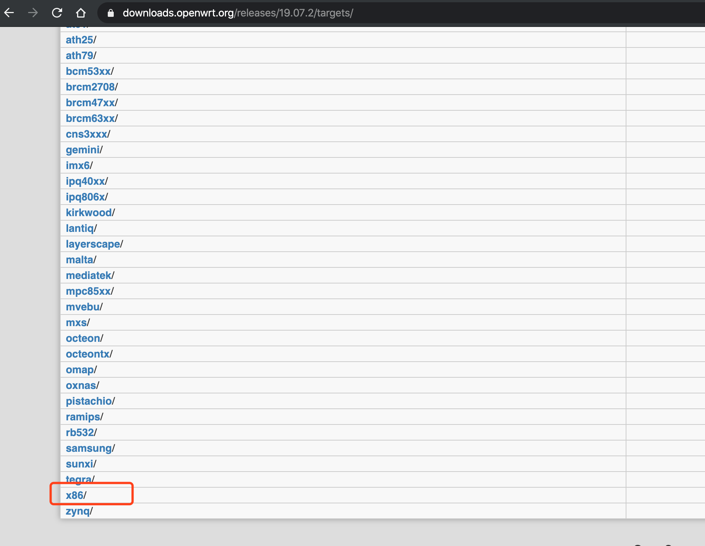
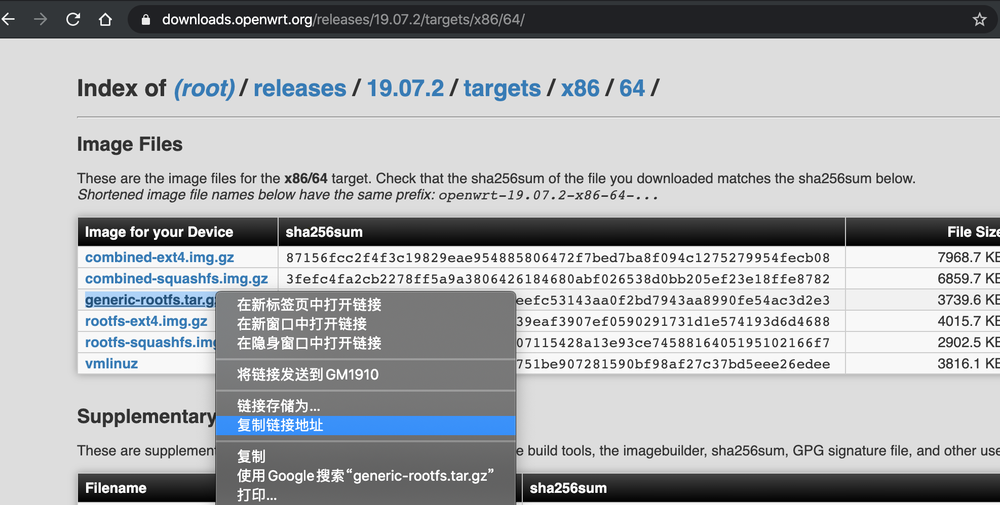

# OpenWrt Docker镜像构建

为了在Docker中运行OpenWrt系统，我们需要用到OpenWrt的docker镜像,网上有很多人分享已经制作好的镜像。但是，每个人都有自己不同的需求，自己学会制作镜像就显得特别重要了。


其实使用OpenWrt的固件, 可以很方便的构建Docker镜像，这里的固件不光是官方固件，也可以是经过自己定制编译生成的固件。

## 直接使用

如果你只想下载并使用，不关心构建流程，那么你可以用下面的命令直接下载

```bash
# 下载镜像
$ docker pull crazygit/openwrt-x86-64

# 查看镜像信息
$ docker run --rm crazygit/openwrt-x86-64 cat /etc/banner
  _______                     ________        __
 |       |.-----.-----.-----.|  |  |  |.----.|  |_
 |   -   ||  _  |  -__|     ||  |  |  ||   _||   _|
 |_______||   __|_____|__|__||________||__|  |____|
          |__| W I R E L E S S   F R E E D O M
 -----------------------------------------------------
 OpenWrt 19.07.2, r10947-65030d81f3
 -----------------------------------------------------
```

## 手动构建

如果你对自己构建感兴趣，可以继续看下去

### 使用官方固件

这里以`x86-64`平台为例

#### 首先获取获取固件的下载地址

1. 打开[官网](https://downloads.openwrt.org/)，选择当前最新的稳定版本`19.07.2`

2. 选择`x86`平台

3. 选择`64`位

4. 选择固件`generic-rootfs.tar.gz`

5. 鼠标右键点击"复制链接地址"获取到固件的下载地址，第6步会用到

6. 构建镜像

    ```bash
    $ git clone https://github.com/crazygit/openwrt-x86-64.git openwrt-x86-64
    $ cd openwrt-x86-64
    # 参数1: 第5步中获取的固件下载地址
    # 参数2: docker镜像的名字，可以随便指定: 如crazygit/openwrt-x86-64
    $ ./build.sh "https://downloads.openwrt.org/releases/19.07.2/targets/x86/64/openwrt-19.07.2-x86-64-generic-rootfs.tar.gz" crazygit/openwrt-x86-64
    ```

### 构建自己的镜像

1. 编译自己的固件(这个步骤比较多，网上相关介绍也比较多，在此不再展开描述)
2. 下载本库

    ```bash
    $ git clone https://github.com/crazygit/openwrt-x86-64.git openwrt-x86-64
    ```
3. 拷贝自己的固件到`Dockerfile`文件所在的目录,固件文件名后缀应该是`.tar.gz`的

    ```bash
    $ cd openwrt-x86-64
    $ cp /path/to/your/firmware.tar.gz openwrt.tar.gz
    ```

4. 编译镜像

    ```bash
    # -t后面为镜像的名字，可以随便指定: 如: crazygit/openwrt-x86-64
    $ docker build . --build-arg FIRMWARE=openwrt.tar.gz -t crazygit/openwrt-x86-64
    ```

## 使用Github Action自动构建

1. Fork当前仓库
2. 在项目`Settings->Secrets`里配置你的docker hub账户的用户名和密码`DOCKER_USERNAME`和`DOCKER_TOKEN`
3. 在docker hub上创建你在一个仓库来存放编译的镜像
4. 根据自己的情况修改`.github/workflows/build.yml`文件中的如下环境变量

    ```yaml
    env:
      FIRMWARE_URL: "https://downloads.openwrt.org/releases/19.07.2/targets/x86/64/openwrt-19.07.2-x86-64-generic-rootfs.tar.gz"
      REPOSITORY: crazygit/openwrt-x86-64
      TAG: 19.07.2
    ```
5. 提交修改之后，github action会自动编译镜像并将镜像push到你的docker hub账户中指定的仓库里

### 验证镜像

下面的命令注意替换镜像名字`crazygit/openwrt-x86-64`为你自己编译时使用的名字

1. 查看编译的镜像

    ```
    $ docker image ls |grep crazygit/openwrt-x86-64
    crazygit/openwrt-x86-64                                                          latest              07f578cefd53        12 minutes ago      9.43MB
    ```

2. 验证镜像是否正常

    ```bash
    $ docker run --rm crazygit/openwrt-x86-64 cat /etc/banner
    _______                     ________        __
    |       |.-----.-----.-----.|  |  |  |.----.|  |_
    |   -   ||  _  |  -__|     ||  |  |  ||   _||   _|
    |_______||   __|_____|__|__||________||__|  |____|
            |__| W I R E L E S S   F R E E D O M
    -----------------------------------------------------
    OpenWrt 19.07.2, r10947-65030d81f3
    -----------------------------------------------------
    ```

### 使用镜像

镜像的使用可以参考下面两篇文章的方式进行配置

* [在Docker 中运行 OpenWrt 旁路网关](https://mlapp.cn/376.html)
* [Docker上运行Lean大源码编译的OpenWRT](https://openwrt.club/93.html)


### 参考

本文构建过程参考自:

<https://openwrt.org/docs/guide-user/virtualization/docker_openwrt_image>

备注: 官网中的`Dockerfile`示例有一处错误是

```
ADD https://downloads.openwrt.org/chaos_calmer/15.05/x86/generic/openwrt-15.05-x86-generic-Generic-rootfs.tar.gz /
```
上面的语句是无效的，因为`ADD`指令只有在添加本地的`.tar.gz`文件时才会自动解压，添加`URL`时不会自动解压。建议使用本仓库的`Dockerfile`
